## 01 -- The Run 
I queued a 1,100-page document and sat there. Not because I needed to babysit it, but because I'd already learned the hard way not to trust a green checkmark from this pipeline until I'd actually watched it succeed end to end.

Good call. Forty minutes in, the first activity timeout came through. Then a retry. Then a second timeout on the retry. Then a stretch long enough that I checked whether the process had actually died because nothing was moving at all. The workflow wasn't crashing. It was worse than crashing: it was alive, doing something, and that something wasn't progress.

Eventually it finished. Just under 8 hours for a document that, on paper, should have taken a fraction of that, because preprocessing and OCR per page are both cheap operations. Almost none of those 8 hours was real work.

> I remember closing the laptop after that run and just sitting there, contemplating, for a few minutes. Not because the bug was hard, but because I'd built this thing believing I understood it, and I very clearly didn't.

The benchmark run actually belonged to a clinical document processing pipeline, where large unstructured clinical documents are processed to extract medical entities, facts, and summaries. For this article, let's just zoom into a specific activity of the pipeline that takes in scanned, multi-page documents, where each page gets turned into an image, the image gets cleaned up (resized, contrast-corrected, denoised), and then handed to an OCR model to pull the text out. Simple enough on a five-page test file. The benchmark run on 1,100 pages is where it stopped being simple.

## 02 -- Why I Was Confident Going In
The OCR step was already running concurrently, and it happened to work well. A page came in, an async call went out to the model, and while it waited on the network, the event loop moved on to the next page. No drama, no surprises, exactly the throughput you'd expect. 

So when I got to the preprocessing step - the OpenCV stage before the OCR ever sees an image, the logic felt obvious. Parallelism had just worked for one stage of this pipeline, so my immediate instinct was *"Why wouldn't it work for the next one?"*. I reached for the same instinct: thread pool, fan it out with `asyncio.gather`, problem solved.

```python
with ThreadPoolExecutor(max_workers=max_preprocessing_workers) as executor:  
    preprocessed_pages = await asyncio.gather(
        *[loop.run_in_executor(executor, preprocess_page, page) for page in page_images]
    )
```

On small test files it looked completely fine. A few pages, a couple of saved seconds, nothing to question. I shipped it and moved on to the next thing.

## 03 -- Fighting the Wrong Battle
Then we started benchmarking against real workloads: large, multi-hundred-page scanned documents, the kind this pipeline actually has to process in production, not clean test fixtures.

It fell apart. Not "*slow*." It just fell apart. Activities timing out. The workflow engine retrying work that hadn't actually failed. Long stretches where the workflow just sat there, stalled, doing nothing visible at all. I sat through a full run on a 1,100-page document just to see it through to the end. Almost 8 hours. Most of it wasn't real processing time. It was the pipeline repeatedly tripping over itself.

My first instinct was the obvious one: turn the dial. I bumped `max_preprocessing_workers` up.

It didn't feel like a gamble. More workers had meant more throughput in almost every system I'd worked on before this one. Scaling throughput by adding workers had become almost a reflex. If one worker helped, more workers should help more. At worst, I expected the gains to flatten out once the CPU was fully utilized.

Instead, the benchmark got worse. It didn't just fail to scale. It actively regressed. That was the first moment I realized I wasn't looking at an ordinary resource bottleneck. If the CPU were simply running out of capacity, I'd expect throughput to plateau once all the cores were busy. Adding workers shouldn't consistently make things slower.

Looking back, it's tempting to say the explanation was simply "the GIL." I don't think that's quite honest.

The GIL was certainly part of the picture. Every preprocessing thread still had to execute Python code around the OpenCV calls, so more threads meant more contention whenever execution returned to the interpreter. But that wasn't the whole story. OpenCV frequently parallelizes parts of its own native operations internally, independent of anything my `ThreadPoolExecutor` was doing. On top of that came simple CPU oversubscription: more runnable threads than physical cores, more scheduler overhead, and more cache thrashing.

I didn't profile that benchmark deeply enough to tell you which of those mechanisms dominated, and I don't think pretending otherwise would make this story more useful. What mattered was that adding threads consistently pushed the system in the wrong direction. Whatever I was fighting, it wasn't the kind of bottleneck that more workers were going to solve. 

So I stopped trying to make preprocessing faster and started assuming the timeouts themselves were the real problem. The obvious answer was more retries. Timeouts under load usually point to transient failures, and retries exist for exactly that reason. If an activity occasionally failed because the system was busy, giving it another chance felt like the safest thing I could do.

The benchmarks got worse. Not immediately, but unmistakably. The failures started clustering. Long stretches where nothing happened, followed by a burst of retries arriving almost together. That didn't look like random flakiness anymore. Random failures don't usually organize themselves into patterns.

It took me a while to realize I wasn't recovering from the problem. I was feeding it.

The preprocessing threads and the `asyncio` event loop lived inside the same process. The event loop still needed opportunities to execute Python code so it could schedule callbacks, resolve futures, and, most importantly, send the workflow engine's activity heartbeat. If those preprocessing threads were already tying up the process, the event loop was waiting behind the same bottleneck, with no special priority over it. A missed heartbeat reads to the workflow engine as a stalled activity, which triggers exactly the kind of retry I was manually adding more of. I wasn't giving the system more chances to succeed. I was handing it more fuel for a fire I couldn't fully diagnose yet, because every retry threw more preprocessing load at a process that was already struggling to make Python-level progress at all.

Eventually I turned preprocessing off completely. It wasn't a thoughtful decision, and I'd rather not pretend it was. I needed the benchmark to stop failing long enough to think clearly, and removing the stage was the fastest way to quiet everything down. 

It worked, in the narrowest sense possible. It bought me time and taught me something about debugging. There's a specific kind of exhaustion that comes from watching the same failure happen over and over without understanding why. Only after that did I stop trying to make the benchmark pass and start trying to understand it. I stopped patching the pipeline and started measuring it instead. And there it was, the shape of the problem appeared before I had a name for it. 


If preprocessing really were a fixed cost per page, the benchmark should have scaled roughly linearly. It didn't, doubling the workload consistently cost more than double the time, and identical runs varied by hours. At that point I still didn't know exactly what I was looking at, I just knew the system was trying to tell me something that "more workers" and "more retries" couldn't explain.

## 04 -- The Cascade
The missing piece finally clicked into place. Whatever was starving the process's ability to make Python-level progress, whether it was GIL contention, CPU oversubscription, OpenCV's own internal threading, or some combination of all three, wasn't just slowing down the preprocessing threads. It was slowing down the entire process, which included the event loop. 

The event loop still needed opportunities to execute Python code so it could schedule callbacks, resolve futures, and, most importantly, send the workflow engine's activity heartbeat. If preprocessing was already monopolizing the process's ability to make forward progress, the event loop wasn't somehow exempt from that pressure. It was waiting behind the same bottleneck.

```mermaid
flowchart TD
    Root["ThreadPoolExecutor Preprocessing<br/>(CPU-bound image work)"] --> Thrashing["Threads contend for the GIL<br/>CPU thrashing, not parallelism"]
    Thrashing --> Starve["GIL contention starves ALL Python-level<br/>execution in the process"]
    Starve --> EventLoop["Event loop thread<br/>can't get scheduled"]
    EventLoop --> Missed["Heartbeat coroutine<br/>misses its window"]
    Missed --> Timeout["Workflow engine marks activity stalled<br/>triggers a retry"]
    Timeout --> MoreLoad["Retry adds MORE preprocessing load<br/>to an already-saturated process"]
    MoreLoad -.-x|Loops back, compounding| Thrashing
    style Root fill:#333,stroke:#666
    style Thrashing fill:#400,stroke:#f00
    style Starve fill:#400,stroke:#f00
    style EventLoop fill:#222,stroke:#ff5c00
    style MoreLoad fill:#400,stroke:#f00,stroke-width:2px,stroke-dasharray: 5 5
```



This is the full shape of what I'd been creating. Every missed heartbeat looked like a stalled activity. Every stalled activity triggered another retry. Every retry added another round of preprocessing to a process that was already struggling to make forward progress. The loop kept feeding itself, that's where most of the eight hours came from. It was a small amount of real work buried underneath the same feedback loop triggering over and over again. More pages didn't simply mean more work, they meant more chances for the system to make itself worse.

This feedback loop explains most of the eight-hour runtime, but it doesn't explain all of it. Underneath it was a second, completely independent mistake. It had nothing to do with the GIL or thread contention, and I didn't discover it until after this loop was already gone.

## 05 -- The Second Bug
With the feedback loop gone, I reran the 1,100-page benchmark expecting everything to finally behave, but it didn't. It was dramatically better, but OCR requests were still getting dropped under load. This time, though, there was no thread contention left to blame.

My first assumption was that the OCR-serving pod had simply run out of compute. It hadn't, the usage on the pod sat comfortably under half its limit the entire time requests were getting dropped. That ruled out compute as the bottleneck immediately, which meant the problem had something to do with how the requests were arriving.

So I went and actually did the arithmetic on the concurrency, instead of assuming it was sane. The OCR serving pod was provisioned for 10 concurrent active requests, with a queue depth of 15 on top of that, a total of 25 requests before it would start rejecting anything further. On the client side, the workflow worker was capped at 5 concurrent activities, and the preprocessing pool was sized to match, also 5. On paper, 5 looked like a safe, conservative number against a 25-request budget.

The number that actually mattered wasn't 5. Each of those 5 concurrent activities was processing a chunk of pages (20 pages each) and fanning every single page out to the OCR model concurrently via `asyncio.gather`, because that fan-out was never bounded by anything. Five activities, twenty OCR calls each, all in flight at once, is up to a hundred simultaneous requests landing on a pod sized to hold twenty-five.

> I actually laughed when I worked that number out. Not because it was funny but because it was so obvious and embarrassingly simple once I'd written it down, and I'd spent real time looking everywhere except at this one multiplication.

This had nothing to do with the GIL, threads, or processes. It was a sizing mismatch between two numbers that lived in completely different parts of the codebase and had never been checked against each other, the activity-level concurrency cap, and the per-activity fan-out width. It had probably been there since before the thread-contention issue ever started, quietly within tolerance at lower page counts, and only became a real, visible problem once enough concurrent activities were running long enough, at high enough volume, for the fan-out math to actually collide with the pod's queue limit.

The fix was a bounded semaphore around the OCR fan-out, capping real in-flight requests to a number that respects the pod's actual budget rather than trusting the activity-level concurrency setting to imply anything about it:

```python
ocr_semaphore = asyncio.Semaphore(8)  # stay under the pod's 10-active budget with headroom

async def run_ocr_bounded(page_image):
    async with ocr_semaphore:
        result = await client.chat.completions.create(...)
        return result.choices[0].message.content
```

The next benchmark was almost uneventful. No dropped requests. The utilization graphs looked exactly as boring as they should have all along. That was its own kind of relief. Sometimes the hardest bugs aren't hidden behind complex systems. They're hiding behind arithmetic you assumed was already correct.

## 06 -- Fixing the Thread-Contention Loop
Back to the first bug, by this point the direction was clear. The preprocessing didn't belong in a thread pool, it belonged in a process pool.
```python
import multiprocessing as mp
from concurrent.futures import ProcessPoolExecutor

ctx = mp.get_context("spawn")

global_process_pool = ProcessPoolExecutor(
    max_workers=5, # In prod, this reflects the pod's cpu quota.
    mp_context=ctx,
    max_tasks_per_child=200,
)

def preprocess_page(page_image) -> str:
    import cv2
    cv2.setNumThreads(0)
    # ... existing OpenCV/NumPy logic ...
    return processed_page
```
On the surface, it looks like a one-line change. In practice, almost every line around it turned out to matter.

A process gets its own interpreter, its own memory space, and its own GIL, fully separate from the parent. Since preprocessing one page has no dependency on any other page, this is embarrassingly parallel work. Separate processes let it actually run across cores in parallel instead of taking turns on one.

The `cv2.setNumThreads(0)` line matters more than it looks. Without it, OpenCV spins up its own internal thread pool inside each worker process and fans out across all visible cores on its own. You'd be trading one oversubscription problem for the same one running simultaneously inside every worker now, which is strictly worse.

`spawn` as the start method is deliberate. On Linux, `ProcessPoolExecutor` defaults to `fork`, which copies the parent's entire memory state at the moment of forking, including lock state held by threads that won't exist in the child. Forking a long-lived worker that already has an active event loop and SDK threads running is a documented way to copy a half-held lock into a process that can never release it. `spawn` starts each worker as a genuinely fresh interpreter instead. It costs more at startup, but the pool is a singleton, so that cost is paid once.

One tradeoff is worth calling out. A per-call `ThreadPoolExecutor` is self-healing. If something inside it dies, it gets torn down and rebuilt on the next invocation. A singleton `ProcessPoolExecutor` isn't. If a worker crashes, every subsequent submission raises `BrokenProcessPool` until the parent process recreates the pool. `max_tasks_per_child=200 `periodically refreshes workers, limiting the damage a crash or slow memory leak can accumulate. I added it proactively rather than waiting to discover I needed it. Whether it was strictly necessary, I can't honestly say.

With preprocessing isolated in child processes, the parent process does almost nothing except submit tasks and wait on IPC pipes. The event loop stays clear. Heartbeats fire on time, and the *doom loop* simply stopped existing.


## 07 -- What `run_in_executor` Is Actually Doing
It's worth being precise about what `loop.run_in_executor()` is doing, because it's doing more than "run this function somewhere else."

It takes a blocking callable and a `concurrent.futures` executor, submits the callable to that executor, and wraps the resulting future in an `asyncio.Future` the event loop knows how to await. That's the whole bridge. The loop doesn't run the preprocessing function itself and doesn't need to know OpenCV exists. It just waits for a future to become ready, much the same way it waits for a socket to become readable. From where the loop sits, those two things look almost identical.

Calling `loop.run_in_executor(None, fn, *args)` uses asyncio's default `ThreadPoolExecutor`. That's exactly why my original implementation felt so natural. It was the default path asyncio offered. Replacing `None` with a `ProcessPoolExecutor` didn't change how the event loop worked at all. It changed where the work happened. From the event loop's perspective, it was still just awaiting a future. The fix isn't a different API. It's the same bridge, pointed somewhere else.

Once I understood that, the OCR path suddenly looked completely different.
```python
async def run_ocr(page_image) -> str:
    result = await client.chat.completions.create(...)
    return result.choices[0].message.content
```

No executor anywhere in this function, because there doesn't need to be. The HTTP client is natively async. `await` suspends the coroutine, the loop services other work, the response arrives, the loop resumes. No thread, no process, no bridge. Executors exist specifically for work that isn't natively async, either a blocking call with no async-aware version, or CPU-bound work with nothing to yield during at all. That distinction is the entire reason this incident happened.

## 08 -- The Numbers
At scale, the pipeline chunked large documents into 20-page batches and fanned them out concurrently across workflow executions. Each batch was taking roughly 10 to 15 minutes before the fix. After the process pool change and the semaphore cap, the same batch came in at 2 to 3 minutes.

That improvement at the batch level doesn't explain the full-pipeline collapse on its own. Preprocessing was never the majority of those 8 hours. What the fix removed was the trigger: once preprocessing stopped starving the event loop, heartbeats stopped getting missed, retries stopped stacking, and the feedback loop responsible for most of the runtime just stopped running. The semaphore fix closed the second gap independently.

> Most of the 8 hours wasn't slow processing. It was the same small amount of real work being done, abandoned, and restarted, over and over again.

## 09 -- In Hindsight
It would make a neater story to say the GIL caused the eight hours. The real answer is less satisfying and probably more useful.

Two independent miscalibrations existed in this system at the same time. One was a process-wide resource getting starved by threads doing the wrong kind of work in the wrong place. The other was a multiplication nobody had checked across two config files. They had nothing to do with each other mechanically. They didn't cause each other. They just both existed, quietly, hidden within the tolerances of small-scale testing, until enough volume arrived to expose both at once and let them compound into something that looked, from the outside, like a single eight-hour disaster.

Fixing the louder one first didn't mean I was done. It meant I could finally see the quieter one underneath, the one that was never producing retries, timeouts, or a cascade diagram. It was just a number. Wrong the whole time. Waiting.

I learned that most failures at scale work like this. Not one root cause in an elaborate disguise, but two or three ordinary ones, each survivable in isolation, sitting together in a system until enough load finally introduces them to each other.

The GIL was real. Thread contention was real. The concurrency mismatch was real too. None of them, by themselves, explained what happened. The incident only made sense once I stopped looking for a single root cause and started looking at how independent parts of the system were interacting.
