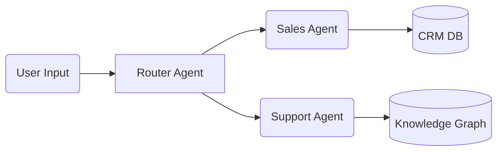

## 01 / The Core Concept
Building multi-agent systems isn't just about chaining LLM prompts. It's about deterministic state management.

If an agent fails mid-execution, you cannot just retry the entire prompt chain. You need a state machine that remembers *where* the agent failed.

### The DAG Execution
We orchestrate this using a DAG.



Here's a simple snippet of how a Router Agent might work:

```python
def route_request(query: str):
    if "buy" in query:
        return "Sales"
    return "Support"
```

## 02 / The Fallback
Always fail gracefully. If the Router fails, fall back to a default human-handoff state.


This ensures the system never gets stuck in a retry storm.
